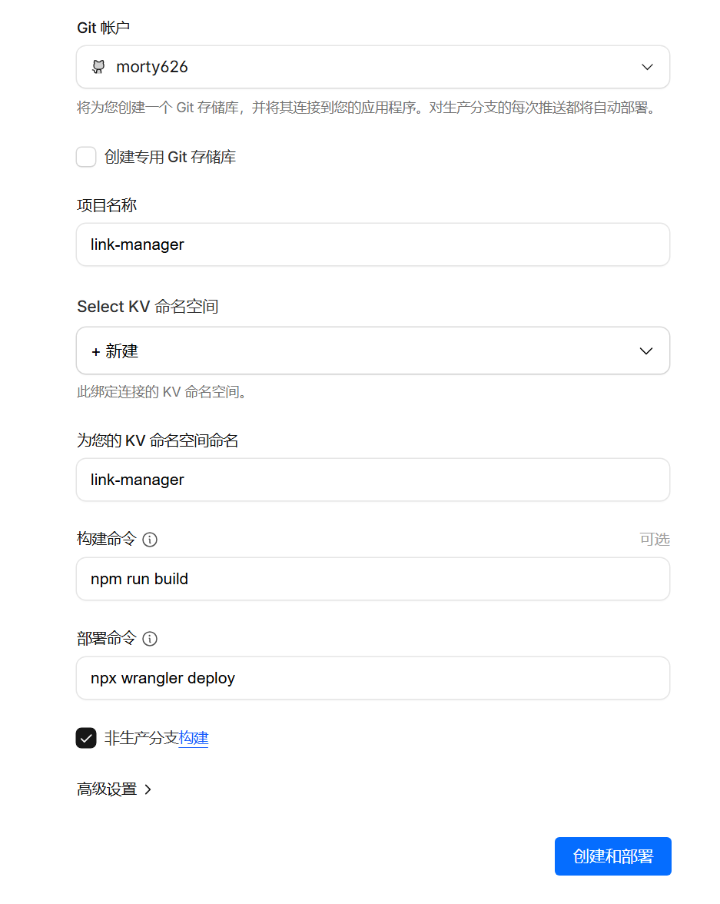
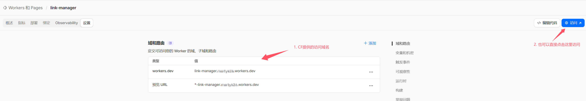
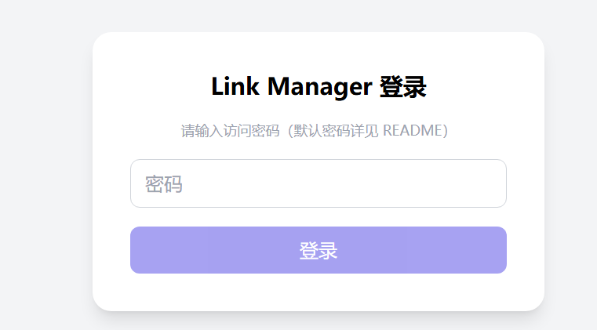
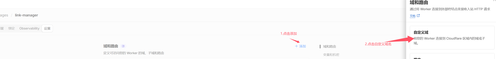

# Link Manager

一个部署在 **Cloudflare Workers** 上的轻量级链接管理工具，用来集中管理常用网址、资源与跳转入口。

- 前端：React + TypeScript + Vite + TailwindCSS
- 后端：Cloudflare Workers
- 数据持久化：Cloudflare KV（命名空间：`LINKS_KV`）

## 功能特性

- ✅ 分类管理链接（支持多分类）
- ✅ 子链接 / 快捷入口（例如：GitHub Issues / PRs、控制台入口等）
- ✅ 支持按「标题 / 描述 / 子链接」搜索
- ✅ 拖拽排序分类和链接
- ✅ 数据备份 / 导入（JSON 文件）
- ✅ 简单密码保护（默认密码，可在线修改）

---

默认登录密码：`linkmanager`（部署后记得修改,如果忘记密码看末尾）

---

## 一键部署到 Cloudflare

你需要准备：

- 一个 Cloudflare 账号
- 绑定支付方式的账户（免费套餐即可）

点击下方按钮即可一键部署到你自己的 Cloudflare 账户中：

[](https://deploy.workers.cloudflare.com/?url=https://github.com/morty626/link-manager)

Cloudflare 大致会完成以下步骤：

1. 读取本仓库代码（必要时帮你 Fork 一份）
2. 根据 `wrangler.jsonc` 创建：
   - Worker 服务：`link-manager`
   - KV 命名空间：`LINKS_KV`
   - 绑定静态资源（`dist/`）到 Worker 的 `ASSETS`
3. 完成构建与部署，并生成一个形如 `xxx.workers.dev` 的访问域名

### 部署流程示意

创建 / 部署 Worker：



查看部署完成后的域名：



首次访问时，会看到登录页面（默认密码见下方）：



---

## 🔐 登录与密码说明

- 默认密码为：

  ```text
  linkmanager
  ```

- 首次部署后：

  1. 在浏览器访问你的 Worker 域名（或自定义域名）
  2. 输入默认密码登录
  3. 登录后可在页面左下角点击 **「修改密码」** 按钮修改为你自己的密码

> 密码不会以明文形式存储，而是以哈希形式存储在 Cloudflare KV 中（键名：`app_config_v1`）。

登录成功后的首页效果示意（默认是空状态，下图为添加示例数据后的样子）：


---

## 本地开发

```bash
# 安装依赖
npm install

# 本地开发（只跑前端 Vite，走 localStorage 模式也可以体验）
npm run dev

# 构建前端
npm run build

# 使用 Cloudflare Workers 本地环境（使用 dist 静态资源 + 本地 KV）
npx wrangler dev
```

访问地址：

- Vite 开发服务器：`http://localhost:5173`
- Wrangler Dev（完整 Worker + 静态资源）：`http://localhost:8787`

---

## 技术说明

### 数据存储

前端通过同源接口 `/api/data` 与 Worker 通信：

- `GET /api/data`：从 KV 中读取完整数据结构：

  ```ts
  {
    categories: Category[];
    links: LinkItem[];
  }
  ```

- `POST /api/data`：将最新的 `{ categories, links }` 写入 KV

在 Worker 中，通过 `env.LINKS_KV` 访问 KV，核心逻辑在 `worker/index.ts` 中实现。

KV 中目前会用到两个 key：

- `APP_DATA`：保存分类与链接数据
- `app_config_v1`：保存应用配置，目前只包含 `passwordHash` 字段

在 Cloudflare KV / Workers 无法访问时（例如本地仅运行 `npm run dev`），前端会自动回退到浏览器 `localStorage` 存储，保证功能基本可用。

### 访问控制与 Cookie

- 登录成功后，后端会设置一个 `LM_AUTH` Cookie，保存密码哈希，用于后续请求鉴权
- 所有 `/api/data` 请求都需要已登录，否则会返回 `401 Unauthorized`
- 修改密码接口为：`POST /api/change-password`

---

## 自定义域名绑定（可选）

部署成功后，可以在 Cloudflare 后台为 Worker 绑定自己的域名，例如：

- `link-manager.xxxxx.com`

操作路径：

> **Workers & Pages → 选择你的 Worker → Custom Domains → Add custom domain**

在输入框中填入你想要的子域名，例如：

- `link-manager.xxxxx.com`
  xxxxx.com 为你已经托管在 cf 上的域名

保存后，Cloudflare 会自动：

- 为该子域名创建对应的 DNS 记录
- 自动签发 SSL 证书

参考示意图：



---

## 重置密码

如果你忘记了登录密码，但仍然可以访问 Cloudflare 管理后台，可以通过清理 KV 配置来恢复默认密码。

步骤：

1. 打开 Cloudflare 控制台 → **Workers & Pages**
2. 进入你的 Worker 服务 → 找到绑定的 KV 命名空间 `LINKS_KV`（例如：`link-manager-links-kv`）
3. 在 KV 管理页面中：

   - 找到并 **删除 key：`app_config_v1`**
   - **不要删除** `APP_DATA`（那是你的所有链接数据）

4. 删除 `app_config_v1` 后，再次访问页面：

   - 密码会恢复为默认密码 `linkmanager`（或你在代码中设置的 `DEFAULT_PASSWORD`）

5. 使用默认密码登录后，立刻在页面内重新设置一个新的密码

---

## License

MIT

```
::contentReference[oaicite:0]{index=0}
```
